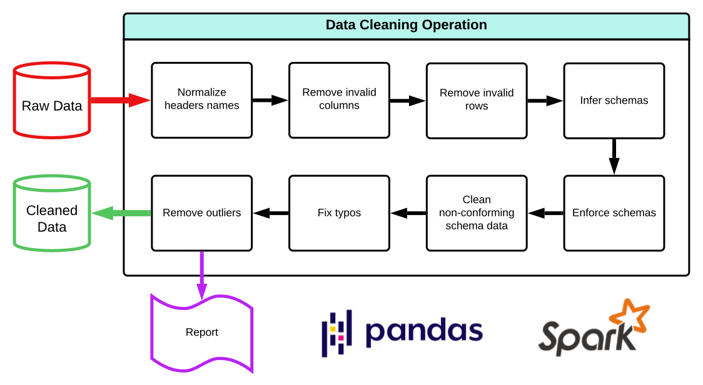

# Data Cleaning and Reporting Tool

This tool is designed for **data preparation** as an initial step for more complex and in-depth data cleaning and validation processes. It simplifies the cleaning process, ensuring that datasets are ready for further analysis or machine learning workflows. There are two options for processing: **Pandas** for small to medium datasets and **PySpark** for large-scale datasets and distributed environments.



## Features

- **Upload CSV Files**: Upload a single CSV file for cleaning and analysis.
- **Primary Key Selection**: Automatically detect numeric columns to be used as primary keys for deduplication.
- **Two Processing Options**:
  - **Pandas**: Optimized for small to medium datasets, offering faster processing for typical data sizes.
  - **PySpark**: Ideal for large datasets, especially in clustered environments with high memory capacities.
- **Data Cleaning**:
  - Normalizes column headers (removes special characters and spaces).
  - Removes empty columns and rows based on a customizable threshold.
  - Detects and removes rows with missing values.
  - Detects potential typos in string columns.
  - Cleans string columns by transforming them (lowercasing, removing extra spaces, etc.).
  - Removes outliers from numeric columns.
  - Deduplicates rows based on the primary key.
- **Report Generation**:
  - Visualizations including heatmaps for missing values, column distribution, boxplots for outliers, and correlation heatmaps.
  - Full reporting on nonconforming cells and process times.
  - A downloadable cleaned CSV file.

## Requirements

- **Python 3.9+**
- **Dependencies**: Install all dependencies via pip:

  ```bash
  pip install -r requirements.txt
